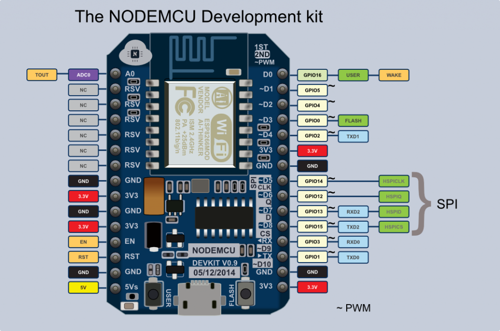

NodeMCU dev Kit V1.0

## SPI Pin mapping for MFRC522 NFC reader on a NodeMCU dev kit V1.0 chip

 wiring the MFRC522 to ESP8266 (ESP-12)

* RST     = GPIO15  ->  D8
* SDA(SS) = GPIO2   ->  D2
* MOSI    = GPIO13  ->  D7
* MISO    = GPIO12  ->  D6
* SCK     = GPIO14  ->  D5
* GND     = GND     ->  GND
* 3.3V    = 3.3V    ->  3.3V
